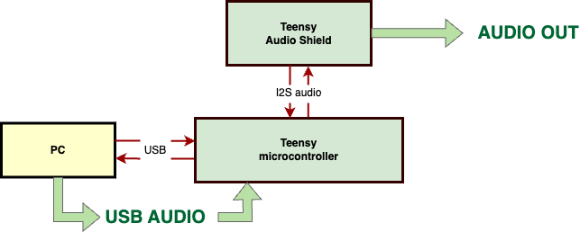

# Teensy Real-Time Audio Processor

## Overview
This project show how to write its own real-time processing code in using Audio Processor on a Teensy microcontroller. The Teensy board functions as a sound card, processing computer audio in real-time. Audio signals are sent to the Teensy, filtered using user own algorithm written in C++, and then output through the Teensy audio shield's jack. In this particular example, a 2nd order IIR filter low-pass filter is implemented. The variables `f` (frequency) and `Q` (quality factor) can be chnaged in real time over the UART (USB) serial port interface.

## Connections
- The Teensy audio shield is directly connected to the Teensy board.
- The Teensy board is connected to the computer via a USB cable.
- No additional hardware setup is required.

## Files

1. **teensy/teensy.ino**:
   - Handles real-time audio processing using an IIR filter.
   - Receives variables `f` (frequency) and `Q` (quality factor)via UART from a PC.

2. **teensy/audio_processor.h**:
   - C++ Header file for the audio processor.

3. **teensy/audio_processor.cpp**:
   - C++ implementation of the audio processor.

## Dependencies
Teensy Libraries:
- `<Audio.h>`

## Compilation

1. **teensy/teensy.ino**
   - Compile and upload this Arduino sketch to the Teensy. Set USB type to Audio + Serial.

2. **ARDUINO IDE**
   - Open the Serial Monitor in ARDUINO IDE. Type `f=1000` and send it to change the cut-off frequency of the filter to 1000 Hz, or `Q=0.98` to change the quality factor of the filter.
