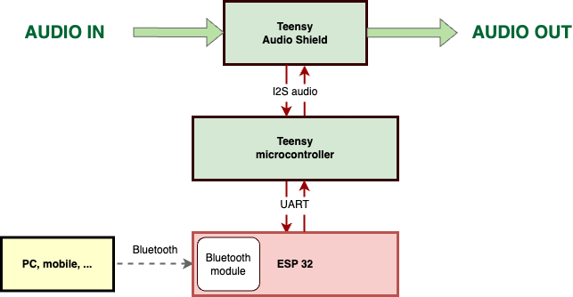
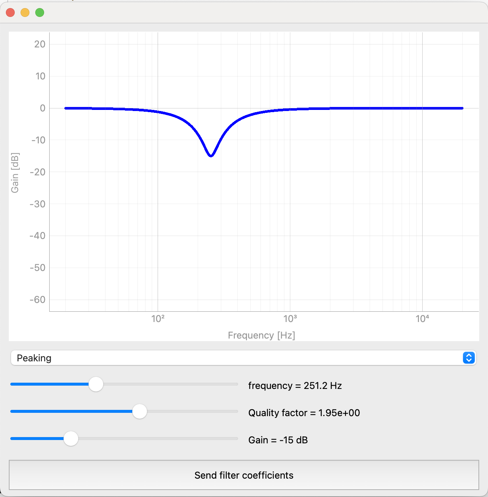

# Teensy Real-Time 2nd Order IIR Filter with Python GUI (Bluetooth Connection using ESP32)

## Overview
This project combines a Python application with a PyQt GUI for designing 2nd order Infinite Impulse Response (IIR) filters, a Teensy microcontroller for real-time audio signal processing, and ESP32 for Bluetooth connectivity. The PyQt GUI interfaces with ESP32 over Bluetooth, sending filter coefficients which are then relayed to the Teensy microcontroller via UART for audio processing.

## Connections
- Audio input connected to the line input of the Teensy audio shield.
- Audio output from the jack connector of the Teensy audio shield.
- ESP32 GND connected to Teensy GND.
- ESP32 TX0 connected to Teensy RX1.

## Files

1. **teensy/teensy.ino**:
   - Performs real-time audio processing using an IIR filter.
   - Receives filter coefficients via UART from the ESP32.

2. **esp32/esp32.ino**:
   - Receives data over Bluetooth and transmits it to the Teensy through UART.

3. **python_to_bluetooth_pyqt.py**:
   - Interface for designing 2nd order IIR filters.
   - Sends filter coefficients in JSON format to the ESP32 board via Bluetooth.

4. **python_functions/filters.py**: 
   - Contains equations for generating 'a' and 'b' coefficients for 2nd order IIR filters.
   - Direct user interaction with this file is not required.

## Dependencies
Python Libraries:
- `numpy`
- `scipy.signal`
- `pyqtgraph`
- `PyQt6`
- `pyserial`
- `json`

Teensy Libraries:
- `<Audio.h>`
- `<ArduinoJson.h>`

ESP32 Libraries:
- `<BLEDevice.h>`
- `<BLEServer.h>`
- `<BLEUtils.h>`
- `<BLE2902.h>`

## Compilation

1. **teensy/teensy.ino**:
   - Compile and upload this sketch to the Teensy microcontroller. Set USB type to Serial.

2. **esp32/esp32.ino**:
   - Compile and upload this sketch to the ESP32 board.

3. **python_to_bluetooth_pyqt.py**:
   - Run this script to operate the GUI. Set your desired filter parameters and press the "Send filter coefficients" button.

