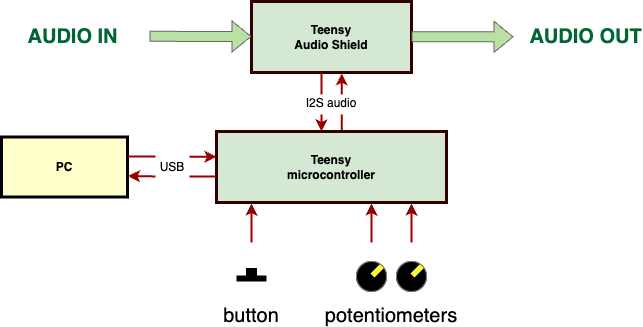
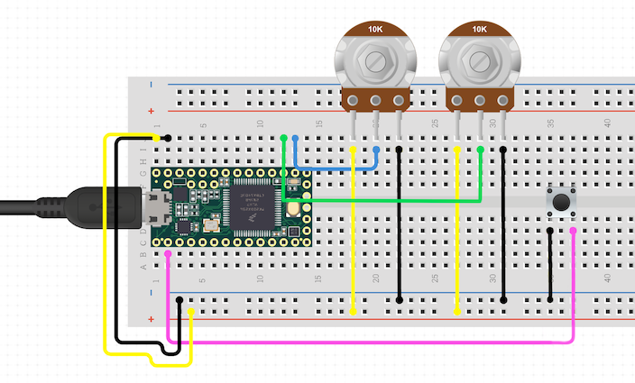
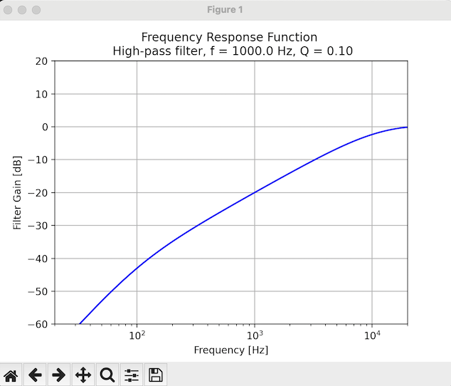

# Teensy Real-Time 2nd Order IIR Filter with potentiometers

## Overview
This project uses a Teensy microcontroller with two potentiometers and one button for designing 2nd order Infinite Impulse Response (IIR) filters. The potentiometers are setting the frequency and quality factor, the button swithes between the low-pass and high-pass filter. The Teensy board, with a Teensy Audio Shield, is processing the input audio signal in real-time. As an addition, the Teensy board sends constantly to the UART transmitter the current parameters and the selected filter type. A python code is provided that constantly reads these values from UART (connected through USB) and plots the current Frequency Response Function of the filter.

## Connections
- Audio input connected to the line input of the Teensy audio shield.
- Audio output from the jack connector of the Teensy audio shield.
- Pottentiometer connected to A0 (frequency) and A1 (quality factor) pins of Teensy board
- Button connected to pin 1 of Teensy board

## Files

1. **teensy/teensy.ino**:
   - Performs real-time audio processing using an IIR filter.
   - Sends filter parameters via UART.

2. **print_serial_ports.py**:
   - Lists the names of available USB ports. Run this to find the name of the port.
   
3. **plot_filter_from_serial.py**:
   - Interface for plotting 2nd order IIR filter Frequency Response Function.
   - Change the variable `SERIAL_PORT = "/dev/cu.usbmodem88092601"` according to the port name form displayed using **print_serial_ports.py** file.

4. **python_functions/filters.py**: 
   - Contains equations for generating 'a' and 'b' coefficients for 2nd order IIR filters.
   - Direct user interaction with this file is not required.

## Dependencies
Python Libraries:
- `numpy`
- `scipy.signal`
- `serial`
- `matplotlib`

Teensy Libraries:
- `<Audio.h>`

## Compilation

1. **teensy/teensy.ino**:
   - Compile and upload this sketch to the Teensy microcontroller. Set USB type to Serial.

2. **print_serial_ports.py**:
   - Run this script to get the correct port name.

3. **plot_filter_from_serial.py**:
   - Run this script to plot the Frequency Response Function in real time.

