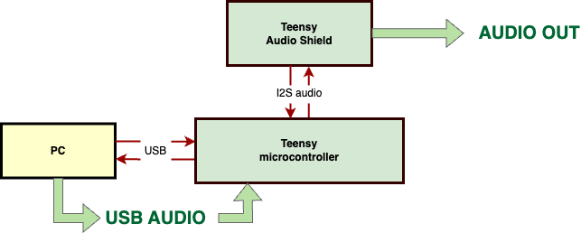
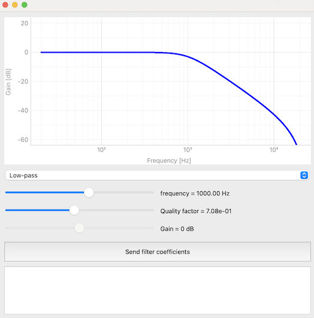

# Teensy Real-Time 2nd Order IIR Filter with Python GUI (UART)

## Overview
This project integrates a Teensy microcontroller with a Python application using a PyQt GUI for designing 2nd order Infinite Impulse Response (IIR) filters. The Teensy board functions as a sound card, processing computer audio in real-time. Audio signals are sent to the Teensy, filtered, and then output through the Teensy audio shield's jack. The PyQt GUI allows users to design filters and send their coefficients to the Teensy via UART.

## Connections
- The Teensy audio shield is directly connected to the Teensy board.
- The Teensy board is connected to the computer via a USB cable.
- No additional hardware setup is required.

## Files

1. **teensy/teensy.ino**:
   - Handles real-time audio processing using an IIR filter.
   - Receives filter coefficients via UART from a PC.

2. **python_to_uart_pyqt.py**:
   - Enables the design of 2nd order IIR filters through a GUI interface.
   - Sends filter coefficients in JSON format to the Teensy board using UART.

3. **python_functions/filters.py**: 
   - Contains equations for generating 'a' and 'b' coefficients for 2nd order IIR filters.
   - User interaction with this file is not required.

## Dependencies
Python Libraries:
- `numpy`
- `scipy.signal`
- `pyqtgraph`
- `PyQt6`

Teensy Libraries:
- `<Audio.h>`
- `<ArduinoJson.h>`

## Compilation

1. **teensy/teensy.ino**
   - Compile and upload this Arduino sketch to the Teensy. Set USB type to Audio + Serial.

2. **python_to_uart_pyqt.py**:
   - Execute this script to run the GUI. Set the desired filter parameters and press the "Send filter coefficients" button.

